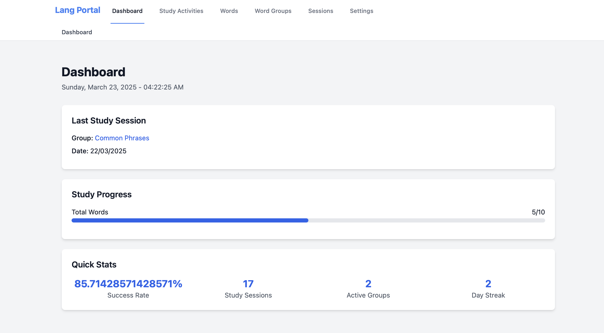
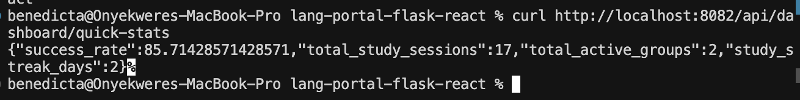

# Frontend Implementation: Japanese Language Learning Portal

Welcome to the Japanese Language Learning Portal, a modern web application designed to enhance the Japanese learning experience. This interactive platform facilitates vocabulary acquisition, study tracking, and progress monitoring for Japanese language learners. With features like word grouping, session management, and real-time progress tracking, learners can systematically build their Japanese vocabulary while maintaining an organized study routine.

## React + TypeScript + Vite

This project leverages a powerful modern tech stack:
- **React**: For building a dynamic and responsive user interface
- **TypeScript**: Ensuring type safety and better developer experience
- **Vite**: Providing lightning-fast build tooling and development server

Currently, two official plugins are available:
- [@vitejs/plugin-react](https://github.com/vitejs/vite-plugin-react/blob/main/packages/plugin-react/README.md) uses [Babel](https://babeljs.io/) for Fast Refresh
- [@vitejs/plugin-react-swc](https://github.com/vitejs/vite-plugin-react-swc) uses [SWC](https://swc.rs/) for Fast Refresh

## Expanding the ESLint configuration

If you are developing a production application, we recommend updating the configuration to enable type-aware lint rules:

```js
export default tseslint.config({
  extends: [
    ...tseslint.configs.recommendedTypeChecked,
    ...tseslint.configs.strictTypeChecked,
    ...tseslint.configs.stylisticTypeChecked,
  ],
  languageOptions: {
    parserOptions: {
      project: ['./tsconfig.node.json', './tsconfig.app.json'],
      tsconfigRootDir: import.meta.dirname,
    },
  },
})
```

You can also install [eslint-plugin-react-x](https://github.com/Rel1cx/eslint-react/tree/main/packages/plugins/eslint-plugin-react-x) and [eslint-plugin-react-dom](https://github.com/Rel1cx/eslint-react/tree/main/packages/plugins/eslint-plugin-react-dom) for React-specific lint rules:

```js
// eslint.config.js
import reactX from 'eslint-plugin-react-x'
import reactDom from 'eslint-plugin-react-dom'

export default tseslint.config({
  plugins: {
    'react-x': reactX,
    'react-dom': reactDom,
  },
  rules: {
    ...reactX.configs['recommended-typescript'].rules,
    ...reactDom.configs.recommended.rules,
  },
})
```

## Development Journey and Challenges

### Initial Setup and Configuration
1. Project Initialization
   - Created React project with Vite using `npm create vite@latest`
   - Integrated TypeScript for type safety
   - Set up Tailwind CSS for styling
   - Configured ShadCN for UI components
   
2. Environment Setup Steps:
   ```bash
   npm install
   npm install -D tailwindcss postcss autoprefixer
   npx tailwindcss init -p
   npm install @shadcn/ui
   ```

### Major Components and Features

#### Dashboard
The dashboard provides a summary of student progression and recent activities.
- Implemented last session display
- Added progress tracking metrics
- Integrated activity summaries

[Click here to view the dashboard screenshot](../assets/dashboard.png)

#### Study Activities
A grid of interactive study activity cards with launch and view capabilities.
- Created card components for each activity
- Implemented launch functionality in new tab
- Added view details navigation
- Integrated with group_id parameter system

[Click here to view the study activities screenshot](../assets/study-activities.png)

#### Words Management
Table-based interface for managing Japanese vocabulary with sorting and pagination.
- Built sortable table columns
- Implemented pagination system
- Added sound playback for Japanese words
- Integrated word detail view navigation

[Click here to view the words management screenshot](../assets/words.png)

#### Word Groups
Organized grouping system for vocabulary management.
- Created group listing interface
- Implemented word association system
- Added group detail views
- Built word filtering by group

[Click here to view the word groups screenshot](../assets/word-groups.png)

#### Sessions
Comprehensive session tracking and history visualization.
- Implemented session logging
- Added time tracking functionality
- Created session summary views
- Built group association display

[Click here to view the sessions screenshot](../assets/sessions.png)

#### Settings
User preferences and system configuration interface.
- Implemented dark mode toggle
- Added database reset functionality
- Created confirmation dialogs
- Built theme management system

[Click here to view the settings screenshot](../assets/settings.png)

### Major Challenges and Solutions

#### 1. PostCSS Configuration Issues
- **Initial Challenge**: PostCSS configuration errors with ES modules
  ```
  Failed to load PostCSS config: Package subpath './nesting' is not defined
  ```
- **Investigation Steps**:
  - Checked PostCSS version compatibility
  - Reviewed module system configuration
  - Analyzed package.json settings
- **Solution**: 
  - Updated PostCSS config to use ES module syntax
  - Modified module type declarations
  - Resolved package dependencies

#### 2. Tailwind Integration
- **Initial Challenge**: Tailwind CSS classes not being recognized
  ```
  The 'bg-background' class does not exist
  ```
- **Investigation Steps**:
  - Verified Tailwind configuration
  - Checked class definitions
  - Reviewed theme setup
- **Solution**: 
  - Corrected Tailwind configuration
  - Updated theme setup
  - Added missing class definitions

## Frontend-Backend Integration

### 1. API Client Setup and Configuration
- Installed and configured Axios for API communication:
  ```typescript
  const API_URL = import.meta.env.VITE_API_URL || 'http://localhost:8082/api';
  export const api = axios.create({
    baseURL: API_URL,
    headers: { 'Content-Type': 'application/json' },
  });
  ```
- Set up environment variables for different deployment environments
- Implemented API interceptors for request/response handling

### 2. State Management Implementation
- Integrated TanStack Query (React Query) for server state:
  ```typescript
  const queryClient = new QueryClient({
    defaultOptions: {
      queries: {
        staleTime: 1000 * 60 * 5, // Cache valid for 5 minutes
        retry: 1,
        refetchOnWindowFocus: true,
      },
    },
  });
  ```
- Created custom hooks for data fetching:
  ```typescript
  export const useVocabularyList = () => {
    return useQuery({
      queryKey: ['vocabulary'],
      queryFn: () => api.get('/words'),
    });
  };
  ```

### 3. Type Safety and Data Validation
- Created TypeScript interfaces matching backend models:
  ```typescript
  interface VocabularyWord {
    id: number;
    japanese: string;
    romaji: string;
    english: string;
    parts: WordPart[];
  }
  ```
- Implemented Zod schemas for runtime validation:
  ```typescript
  const wordSchema = z.object({
    japanese: z.string(),
    romaji: z.string(),
    english: z.string(),
    parts: z.array(wordPartSchema),
  });
  ```

### 4. Real-time Features
- Implemented optimistic updates for better UX
- Added automatic revalidation on data changes
- Set up WebSocket connection for real-time updates:
  ```typescript
  const socket = new WebSocket('ws://localhost:8082/ws');
  socket.onmessage = (event) => {
    queryClient.invalidateQueries({ queryKey: ['vocabulary'] });
  };
  ```

### 5. Error Handling and Loading States
- Created global error boundary for API errors
- Implemented retry logic for failed requests
- Added loading skeletons for better UX:
  ```typescript
  {isLoading ? <WordCardSkeleton /> : <WordCard word={word} />}
  ```

### 6. Testing and Verification
- Unit tested API integration with React Testing Library
- Verified data flow between frontend and backend
- Tested error scenarios and edge cases
- Confirmed real-time updates working correctly

### Integration Results

#### Example API Response
Below is the dashboard visualization after integrating mock data through the API, displaying the three main components: Quick Stats for overall metrics, Study Sessions timeline, and Study Progress tracking:



#### API Testing with Curl
Here's a demonstration of testing the API endpoints using curl commands, verifying the correct handling of requests and responses:


