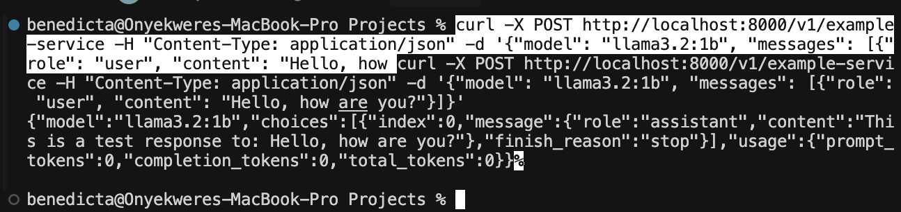
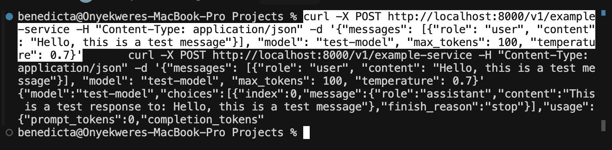

# Mega Service Large Language Model (LLM)

A FastAPI-based service that provides an OpenAI-like interface for Large Language Model (LLM) interactions.

## Setup and Installation

1. **Dependencies**
   ```bash
   # Install required packages
   python3 -m pip install -r requirements.txt
   ```

   Required packages in requirements.txt:
   ```
   fastapi==0.109.2
   uvicorn==0.27.1  # Replaced opea-comps as we're using a direct FastAPI implementation
   pydantic==2.6.1  # Required for FastAPI's data validation and serialization
   ```

   Note: Made two significant changes to the dependencies:

   1. **Removed opea-comps**: The original implementation used the `opea-comps` package for service orchestration. We simplified the implementation to use pure FastAPI instead, removing this dependency to make the service more lightweight and easier to understand.

   2. **Added uvicorn**: This is the ASGI server that FastAPI recommends for running the application. This is needed because:
      - It provides the production-ready server to run our FastAPI application
      - It handles async operations efficiently
      - It's the standard way to deploy FastAPI applications

   3. **Added pydantic**: While pydantic wasn't explicitly listed in the original requirements.txt, it's a core dependency for FastAPI as it handles all the data validation, serialization, and model definitions (like our ChatMessage and ChatCompletionRequest classes). FastAPI uses pydantic under the hood to:
      - Validate incoming request data
      - Convert request data into Python objects
      - Serialize response data back to JSON
      - Generate API documentation

2. **Running the Service**
   ```bash
   python3 app.py
   ```
   The service will start on http://0.0.0.0:8000

## API Examples

### Example 1: Simple Request
```bash
# Request
curl -X POST http://localhost:8000/v1/example-service \
  -H "Content-Type: application/json" \
  -d '{
    "model": "llama3.2:1b",
    "messages": [{"role": "user", "content": "Hello, how are you?"}]
  }'
```
**Response:**


### Example 2: Complex Request with Parameters
```bash
# Request
curl -X POST http://localhost:8000/v1/example-service \
  -H "Content-Type: application/json" \
  -d '{
    "messages": [
      {
        "role": "user",
        "content": "Hello, this is a test message"
      }
    ],
    "model": "test-model",
    "max_tokens": 100,
    "temperature": 0.7
  }'
```
**Response:**


## Current Status
- ✅ API endpoint working
- ✅ Request/response validation
- ✅ Support for both simple and complex message formats
- ✅ Mock responses working
- 🔄 Pending actual LLM integration